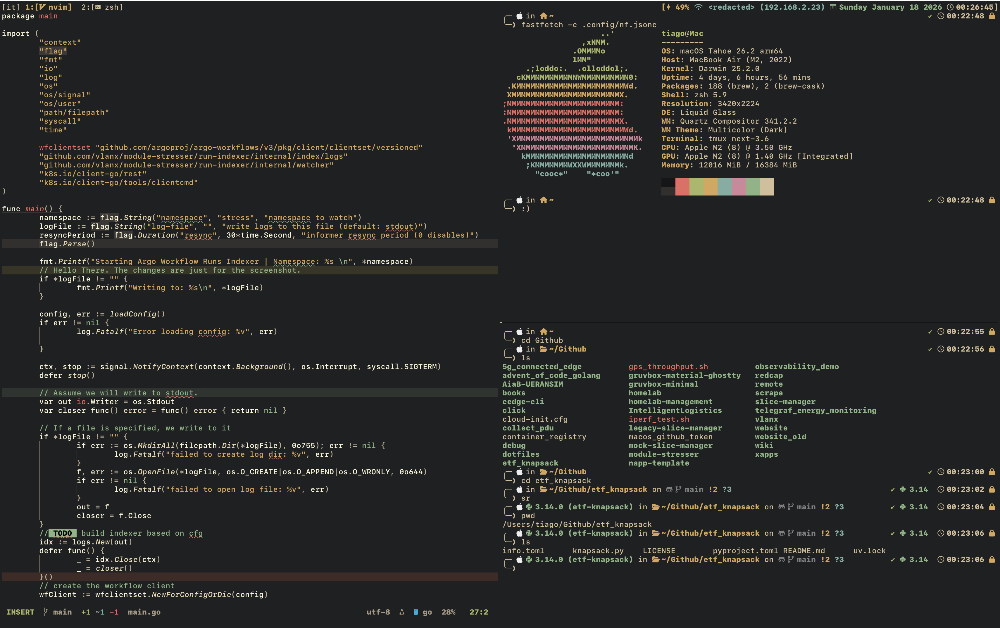

# `[tiago] ~/`

### How it looks:

### What's being used:
- IDE/Dev environment: [neovim](https://neovim.io)
- Neovim Initial Setup: [Kickstart](https://github.com/nvim-lua/kickstart.nvim), but it is now [modularized](https://github.com/dam9000/kickstart-modular.nvim)
- Terminal: [Ghostty](https://github.com/ghostty-org/ghostty)
- Terminal Multiplexer: [Tmux](https://github.com/tmux/tmux)
- Terminal Colorscheme (ported): [Gruvbox Material](./.config/ghostty/config)
- Neovim Colorscheme: [Gruvbox Minimal](https://github.com/dybdeskarphet/gruvbox-minimal.nvim)
- Zsh Theme: [powerlevel10k](https://github.com/romkatv/powerlevel10k) (Customized)

### Notes:

#### My config is heavily influenced by [rwxrob](https://www.youtube.com/@rwxrob)!

- [Stripped down version](https://github.com/vlanx/remote) for remote development/management. Simply clone and get going.
- I frequently switch between `gruvbox-material` and `rose-pine`. Due to my setup, I only have to update neovim's and ghostty's themes.
- No tiling window manager. I only tile the terminal and tmux is the best for that.
- No bloated tmux conf. Only relies on a couple of simple scripts, and the remote version has 0 plugins.
- Ghostty because of the native automatic background detection for macOS.
- p10k because its pretty
- The `/scripts` folder contains some personal scripts that are in my `PATH` and some are called by tmux.
